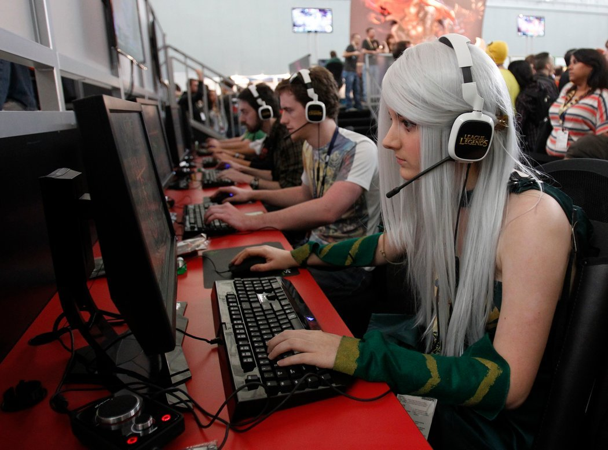
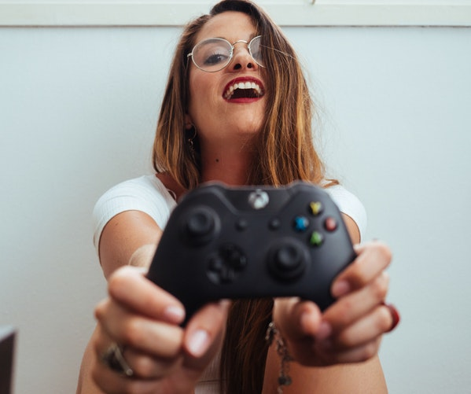
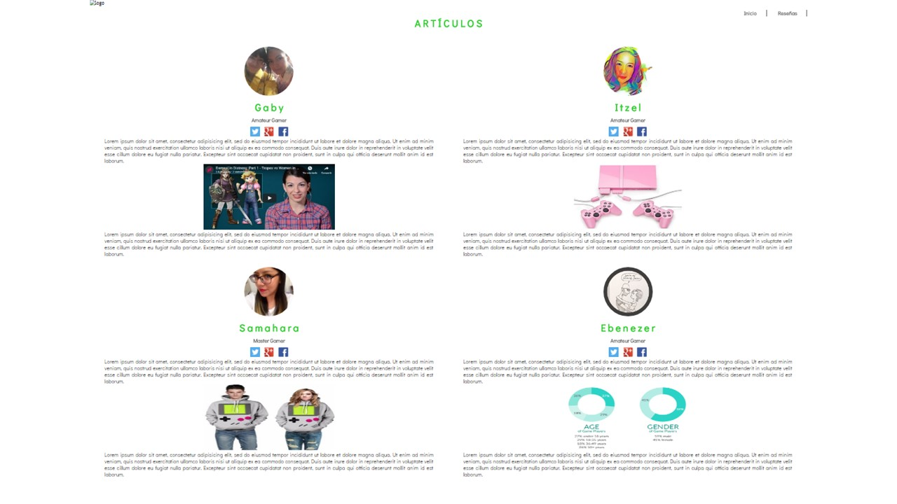
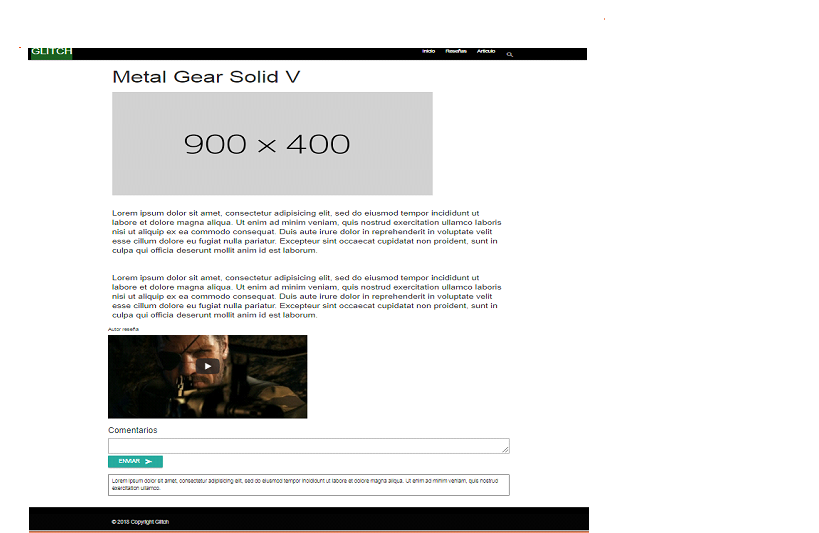

# Glitch

## Origen

Glitch nace como una comunidad dirigida al público femenino que juega videojuegos.

### ¿Por qué creemos que es importante?

El público femenino que juega videojuegos a crecido año con año, sin embargo pareciera que ninguna mujer se siente cómoda para hablar sobre eso.

"Como los hombres, cerca de la mitad de las mujeres juegan videojuegos. Pero es mucho más probable que sea un hombre el que se haga llamar *gamer*.

Los expertos en videojuegos han dicho que no les sorprende que las mujeres eviten una asociación con la cultura del videojuego, puesto que la comunidad de jugadores acérrimos se ha identificado cada vez más con actitudes sexistas entre sus miembros más extremistas."

**- The New York Times**

Estudios demuestran que del 48% que representa el porcentaje de mujeres que juegan videojuegos, el 70% no habla sobre ello.

Ante éste problema quisimos crear una comunidad en la cual las mujeres se sintieran libres de expresarse creando reseñas, contenido, artículos o encontrar más mujeres con las cuales poder interactuar, conocerse e incluso asistir a eventos.

De esta manera generar más confianza entre nuestro público a expresar lo que les gusta y cambiar ese choque por el cual las mujeres no han logrado sentirse seguras en el mundo de los videojuegos.

Gracias a nuestra investigación logramos tener un buen feedback respecto al sitio de **Glitch**.

De nuestras 31 mujeres encuestadas, solo el 38,7% nos dijo que no juega videojuegos, pero el 67,7% de las mismas nos comentó que les cuesta trabajo encontrar contenido dirigido hacia mujeres.

El 74,2% también le gusto la idea de tener una comunidad con la cual pudieran encontrar a más gamers, y tener aportes en una comunidad escrita y creada por mujeres. Ya que a pesar de que solo el 61,3% de las entrevistadas jugaba, muchas de las que nos argumentan que no juegan por falta de tiempo, no tienen consola de videojuegos, no sienten que pudieran pertenecer a ese mundo por poca habilidad, PERO que les encantaría saber más sobre el tema porque les llama la atención, porque les gustaba de pequeñas, porque tienen el interés de saber aunque no sean parte de las que jueguen, etc.  

## Sobre el producto

Nuestro equipo está conformado por:

1. Samahara Fernández (Base de datos, investigación)
2. Ebenezer Gómez (Diseño y desarrollo)
3. Itzel Molina (Diseño y desarrollo)
4. Erika Molina (Diseño y desarrollo)

Creamos una revista digital en la que generamos contenido dirigido a mujeres y reseñas para acercar a más chicas al mundo de los videojuegos.

Nos apoyamos en las API's de Youtube y Facebook para subir contenido visual y para que las personas puedan dejar comentarios en cada una de las secciones.

